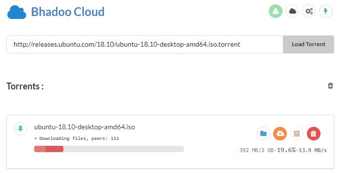

# BhadooCloud

Build from [github.com/Mrigank11/embetacloud](https://github.com/Mrigank11/embetacloud) and [github.com/jpillora/cloud-torrent](https://github.com/jpillora/cloud-torrent)

Fetch Torrents using .torrent file or Magnet Links, Fetch Files from Other Servers to Own Server and Upload to Google Drive.

Open URLs in Proxy to bypass Restrictions (works like VPN)


# Usage

Installation on [AWS Cloud](https://aws.amazon.com/ec2/)

* Select an Ubuntu 18.xx Server Image
* Use [Putty](https://www.putty.org/) to Login using SSH
* Follow the below commands one by one.

```
  sudo apt-get update && sudo apt-get upgrade
  sudo apt-get install linux-image-extra-virtual
```

```
  sudo apt-get install \
    apt-transport-https \
    ca-certificates \
    curl \
    software-properties-common
```

```
  curl -fsSL https://download.docker.com/linux/ubuntu/gpg | sudo apt-key add -
```

```
  sudo apt-key fingerprint 0EBFCD88
```

```
  sudo add-apt-repository \
     "deb [arch=amd64] https://download.docker.com/linux/ubuntu \
     $(lsb_release -cs) \
     stable"
```

```
  sudo apt-get update
```

```
  sudo apt-get install docker-ce
```

```
  sudo docker run hello-world
```

* You'll see a Line saying Hello World that means everything you've done worked till now

```
  sudo usermod -a -G docker $USER
```

* Replace `$USER` with your username, it maybe be `ubuntu` by default.
* Close Putty and Login again.

```
  docker run --name ct -d -p 80:80 --restart always
  -e GOOGLE_CLIENT_ID='***'
  -e GOOGLE_CLIENT_SECRET='***' 
  -e GOOGLE_REDIRECT_URL='***' 
  parveenbhadoo/bhadoocloud node server/server.js --port 80
```

Fill `***` with appropriate values from Google Developer Console.

* You can also Delete the Container using below if needed.

```
  docker stop $(docker ps -a -q)
  docker rm $(docker ps -a -q)
```

# Get Google_Client_ID and Secret

* Open [Google Dev Credentails Site](https://console.developers.google.com/apis/credentials).
* Create a Project, name as you like.
* Enable [Drive API](https://console.developers.google.com/apis/library/drive.googleapis.com)
* In [Credentails Page](https://console.developers.google.com/apis/credentials) Click `Create Credentials` and then Click `OAuth Client ID`.
* Select Web Application.
* In `Authorized JavaScript origins` enter your domain name or IP whichever you are using for Bhadoo Cloud.
* In `Authorized redirect URIs` enter your domain name or IP with `/oauthCallback` at last.
* Use http:// or https:// as available.
* If you are using Cloudflare for website use https:// and Set Flexible HTTPS in Cloudflare.
* Copy your details and use above.
* `GOOGLE_REDIRECT_URL` is same as `Authorized redirect URIs`


For issues or other details visit [github.com/Mrigank11/embetacloud](https://github.com/Mrigank11/embetacloud)
